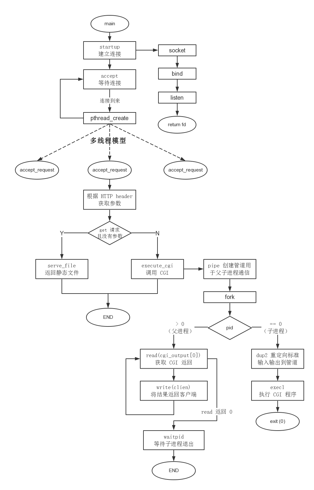

# Tinyhttpd

## 工作流程
- 

- 提取HTTP 请求报文中的请求方法(GET,POST)和url

    - 若是GET方法,且url中携带参数,则query_string指针指向参数头

    - 若是POST方法,开启CGI

- 格式化url到path数组中,表示浏览器请求的服务器文件路径

    - 若 path以 / 结尾, 或 path是个目录

        - 在path后添加index.html,表示访问主页

- 如果文件路径合法

    - 若请求方法是 GET

        - url中带参数,则调用excute_cgi函数执行cgi脚本

        - url中不带参数,直接输出服务器文件到浏览器

    - 若请求方法是 POST

        - 调用excute_cgi函数执行cgi脚本

- 读取剩余的HTTP请求报文

    - 若请求报文是 POST

        - 获取请求头不包含content_length字段,则返回400

##CGI与环境变量

- CGI程序

  服务器为客户端提供动态服务首先需要解决的是得到用户提供的参数再根据参数信息返回。为了和客户端进行交互，服务器需要先创建子进程，之后子进程执行相应的程序去为客户服务。CGI正是帮助我们解决参数获取、输出结果的。

  动态内容的获取其实和请求报文的头部以及请求静态数据的获取完全相同，但请求的资源从静态的HTML文件变成了后台程序。服务器收到请求后fork()一个子进程，子进程执行请求的程序，这样的程序称为CGI程序（Python、Perl、C++等均可）。通常在服务器中我们会预留一个单独的目录（cgi-bin）用来存放所有的CGI程序，请求报文头部中请求资源的前缀都是/cgi-bin，之后加上所请求调用的CGI程序即可。

  所以上述流程就是：客户端请求程序 -> 服务器fork()子进程 -> 执行被请求程序。接下来需要解决的问题就是如何获取客户端发送过来的参数和输出信息怎么传递回客户端。

- 环境变量

  对CGI程序来说，CGI环境变量在创建时被初始化，结束时被销毁。当CGI程序被HTTP服务器调用时，因为是被服务器fork()出来的子进程，所以其继承了其父进程的环境变量，这些环境变量包含了很多基本信息，请求头中和响应头中列出的内容（比如用户Cookie、客户机主机名、客户机IP地址、浏览器信息等），CGI程序所需要的参数也在其中。

- GET方法下参数获取

  服务器把接收到的参数数据编码到环境变量QUERY_STRING中，在请求时只需要直接把参数写到URL最后即可，比如"http:127.0.0.1:80/cgi-bin/test?a=1&b=2&c=3"，表示请求cgi-bin目录下test程序，'?'之后部分为参数，多个参数用'&'分割开。服务器接收到请求后环境变量QUERY_STRING的值即为a=1&b=2&c=3。

  在CGI程序中获取环境变量值的方法是：getenv()，比如我们需要得到上述QUERY_STRING的值，只需要下面这行语句就可以了。

  char *value = getenv("QUERY_STRING");
  之后对获得的字符串处理一下提取出每个参数信息即可。

- POST方法下参数获取

  POST方法下，CGI可以直接从服务器标准输入获取数据，不过要先从CONTENT_LENGTH这个环境变量中得到POST参数长度，再获取对应长度内容。

 ## 细节描述
  
 子进程的color.cgi默认是将html内容输出到标准输出,通过将标准输出重定向cgi_output的写端,从而实现父子进程之间的html内容的通信